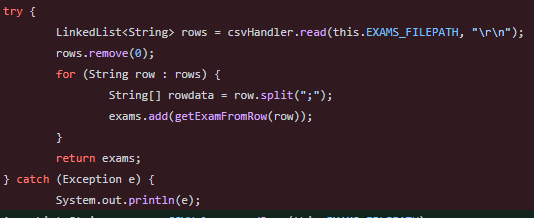
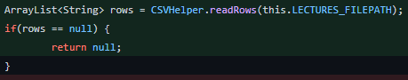
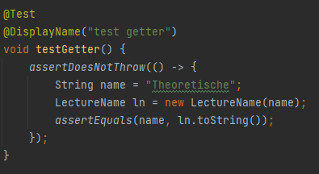
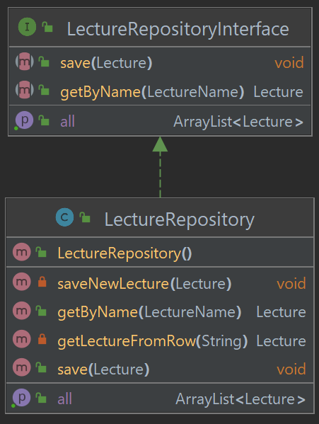

# Dokumentation zum Programmentwurf

## Notenmanager
**Name**: Leonhard Stengel  
**Matrikelnummer**: 8644073  
**Abgabedatum**: 29.05.2022

## Allgemeine Anmerkungen:

- _es darf nicht auf andere Kapitel als Leistungsnachweis verwiesen werden (z.B. in der Form &quot;XY wurde schon in
  Kapitel 2 behandelt, daher hier keine Ausführung&quot;)_
- _alles muss in UTF-8 codiert sein (Text und Code)_
- _sollten mündliche Aussagen den schriftlichen Aufgaben widersprechen, gelten die schriftlichen Aufgaben (ggf. an
  Anpassung der schriftlichen Aufgaben erinnern!)_
- _alles muss ins Repository (Code, Ausarbeitung und alles was damit zusammenhängt)_
- _die Beispiele sollten, wenn möglich vom aktuellen Stand genommen werden_
    - _finden sich dort keine entsprechenden Beispiele, dürfen auch ältere Commits unter Verweis auf den Commit
      verwendet werden_
    - _Ausnahme: beim Kapitel &quot;Refactoring&quot; darf von vorneherein aus allen Ständen frei gewählt werden (mit
      Verweis auf den entsprechenden Commit)_
- _falls verlangte Negativ-Beispiele nicht vorhanden sind, müssen entsprechend mehr Positiv-Beispiele gebracht werden_
    - _Achtung: werden im Code entsprechende Negativ-Beispiele gefunden, gibt es keine Punkte für die zusätzlichen
      Positiv-Beispiele_
    - _Beispiele_
        - &quot;_Nennen Sie jeweils eine Klasse, die das SRP einhält bzw. verletzt.&quot;_
            - _Antwort: Es gibt keine Klasse, die SRP verletzt, daher hier 2 Klassen, die SRP einhalten: [Klasse 1]
              , [Klasse 2]_
            - _Bewertung: falls im Code tatsächlich keine Klasse das SRP verletzt: volle Punktzahl ODER falls im Code
              mind. eine Klasse SRP verletzt: halbe Punktzahl_
- _verlangte Positiv-Beispiele müssen gebracht werden_
- _Code-Beispiel = Code in das Dokument kopieren_

## Kapitel 1: **Einführung**

### Übersicht über die Applikation

Diese Anwendung soll Studenten dabei unterstützen, einen Überblick über ihr Studium zu behalten. 
Nutzer können ihre Vorlesungen verwalten und Prüfungen zu den Modulen anlegen. 
Daraus kann dann der aktuelle Notenschnitt einer Vorlesung oder des gesamten Studiums berechnet werden. 
Um den Notenschnitt wirklich akkurat berechnen zu können, fügen Nutzer zu jeder Vorlesung die Anzahl der ECTS Punkte hinzu und versehen jede Prüfung mit einem Gewicht und einer Note.
Aus diesen Parametern lassen sich dann die Noten berechnen.

### Wie startet man die Applikation?

### Wie testet man die Applikation?

## Kapitel 2: Clean Architecture

### Was ist Clean Architecture?

Beim Ansatz der Clean Architecture geht es im Kern darum, ein Softwareprojekt
in mehrere Schichten zu unterteilen und so beispielsweise Applikationslogik von
Domain-Klassen zu trennen. Dies kann mit den Schichten einer Zwiebel verglichen
werden und ermöglicht es, schnell und ohne viel Aufwand Abhängigkeiten wie zum
Beispiel die Datenbank auszutauschen. Zusätzlich soll jede Komponente nur über
die für sie relevanten Sachverhalte Bescheid wissen und es soll eine
Tätigkeitskapselung entstehen.

### Analyse der Dependency Rule

Die Dependencies der Anwendung sind streng hierarchisch. Obere Schichten sind nur von unteren Schichten abhänging, nicht anders herum.

#### 1. Positiv-Beispiel
Das erste positive Beipiel betrifft die Domain-Klasse Exam. Die Klasse greift auf keine andere Schicht außerhalb der Eigenen zu:

Schichtenübergreifende Abhängigkeiten gehen stest von außen nach innen. Die Abhängigkeiten zwischen ExamRepository bzw. ExamService und Exam sind stets entsprechend realisiert.

#### 2. Positiv-Beispiel
Ein weiteres positives Beispiel zeigt die Verarbeitung der Domainklasse Lecture.

In der Abbildung sind einige Klassen zu sehen, die bei der Asuführung der Aktion List Lectures involviert sind. Sie sind entsprechend ihrer Schicht von oben nach unten angeordnet. Auch steht keine Klasse mit einer anderen Klasse in einer höheren Schicht in Abhängigkeit.

### Analyse der Schichten

#### Domain-Schicht
Eine Klasse der Domain Schicht ist die Exam Klasse:

Diese Klasse ist eine Entity, die das Business Object Prüfung darstellt. Sie ist unabhängig gegenüber Anzeige- oder Speicherungsänderungen. Desshalb ist die Klasse in der Domain-Schicht zu verorten. 

#### Plugin-Schicht
Eine Klasse der Plugin Schicht ist die ListExamAction Klasse:

Die Klasse implementiert das Interface ActionInterface. Beide liegen in der äußersten Schicht Plugin. Die Klasse definiert das Interface, mit dem der Nutzer die Aktion zum Anzeigen seiner Lectures steuern kann. Wie das Interface ausimplementiert wird, ist sehr flexibel und wird häufig angepasst. Desshalb ist diese Klasse in der Plugin-Schicht zu verorten.

## Kapitel 3: SOLID

### Analyse Single-Responsibility-Principle (SRP)
SRP besagt, dass jede Klasse stets nur eine Aufgabe erfüllen sollte.
#### Positiv-Beispiel
Ein positives Beispiel ist die Unterteilung der unterschiedlichen Actions in verschiedene Klassen. Jede Klasse ist dabei für eine einzige Interaktion mit dem Nutzer verantwortlich.

#### Negativ-Beispiel
Die Klasse CSVHandler ist ein negatives Beispiel für SRP.

Die Aufgabe hat nämlich zwei Aufgaben: das Schreiben und das Lesen von CSV Dateien. Dies könnte gelöst werden, indem man die Klasse CSVHandler in zwei Klassen CSVreader und CSVwriter teilt.

### Analyse Open-Closed-Principle (OCP)
Das Open-Closed-Principle besagt, dass Module stets offen für Erweiterungen aber auch verschlossen gegenüber Modifikationen sein sollten.
#### Positiv-Beispiel
Für OCP ist erneut die Strukturierung der Action Klassen ein positives Beispiel.

Um eine neue Interaktion zu entwickeln müssen nicht bestehende Klassen modifiziert werden, sondern es kann eine neue Klasse erstellt werden, die das ActionInterface implementiert. Dafür muss dann lediglich noch die HashMap in der StartAction angepasst werden, in der die Eingaben des Nutzers einer Action zugeordnet werden. Entsprechend sind die Actions offen für Erweiterung und verschlossen gegenüber Manipulationen.

#### Negativ-Beispiel

*ToDo*

### Analyse Liskov-Substitution- (LSP), Interface-Segreggation- (ISP), Dependency-Inversion-Principle (DIP)

#### Positiv-Beispiel
*ToDo*

#### Negativ-Beispiel
*ToDo*

## Kapitel 4: Weitere Prinzipien

### Analyse GRASP: Geringe Kopplung

Geringe Kopplung bezeichnet ein Ziel beim Design, die Abhängigkeiten von Klassen zur Umgebung möglichst gering zu halten.

#### Positiv-Beispiel
Ein positives Beispiel sind hier erneut die Action Klassen.

Dadurch, dass jede Action über die Implementierung des Interfaces realisiert werden, sind diese nur von ActionInterface abhängig. Der Zugriff auf die Funktionalität einer Action erfolgt stets über das Interface. Entsprechend kann sich die genaue Implementierung flexibel ändern. Die Kopplung ist also sehr gering.
#### Negativ-Beispiel
*ToDo*

### Analyse GRASP: Hohe Kohäsion

Eine Hohe Kohäsion begrenzt die Komplexität des Gesamtsystems, indem Klassen überschaubar organisiert werden.  Die Abbildung zeigt als positives Beispiel die Klasse Lecture.

Um die Kohäsion in der Klasse hoch zu halten, werden die Eigenheiten vom Namen, Semester und ECTS-Punkten in eigene Klassen ausgelagert. So bleibt die Klasse Lecture simpel und überschaubar.
### Don't Repeat Yourself (DRY)
Sowohl in LectureRepository, als auch in ExamRepository wurde in den getAll Methoden die entsprechende CSV Datei eingelesen, die erste Headerzeile entfernt und dann die einzelnen Zeileneinträge weitergegeben. Dieser Codeabschnitt war in beiden Fällen identisch, wesshalb er in eine CSVHelper Klasse ausgelagert wurde.

Jetzt müssen Methoden zum Weiterverarbeiten von den CSV Dateien nur noch diese eine Methode aufrufen und erhalten die relevanten Zeilen.

Wenn sich an der CSV Datei oder am Einlesevorgang etwas ändert, kann dies nun an einer zentralen Stelle umgesetzt werden.

[Link zu Commit](https://github.com/leonhardstengel/ASENotenmanager/commit/5c1b9fbee3d1e87147b97174a0e4e87aed241451)

## Kapitel 5: Unit tests

### 10 Unit tests

Die folgende Tabelle umfasst eine Auswahl der Unit-Tests der Notenmanager-Applikation.

| Unit Test                                    | Beschreibung                                                                                          |
|----------------------------------------------|-------------------------------------------------------------------------------------------------------|
| testGetByName@LectureServiceTest             | Testet, dass zu einem LectureName die richtige Lecture zurückgegeben wird.                            |
| testGetNonExistantLecture@LectureServiceTest | Testet, dass bei der Suche nach einer nicht vorhandenen Vorlesung eine Exception geworfen wird.       |
| testCreate@LectureServiceTest                | Testet, ob Lectures angelegt werden.                                                                  |
| testGetByLecture@ExamServiceTest             | Testet, ob nur Examen, die Teil der angegebenen Vorlesung sind, zurückgegeben werden.                 |
| testInvalidCreate@ExamServiceTest            | Testet, ob bei Angabe einer nicht existenten Lecture ein Fehler bei der Erstellung des Exams auftritt |
| testValidCreate@ExamServiceTest              | Testet, ob die Erstellung eines Exams mit validen Eingabeparametern fehlerfrei erfolgt.               |
| testInvalidValues@LectureNameTest            | Testet, ob nicht erlaubte Eingaben aufgefangen werden.                                                |
| testValidValues@LectureNameTest              | Testet, ob LectureNames mit validen Parametern erstellt werden können.                                |
| testInvalidValues@GradeTest                  | Testet, ob nicht erlaubte Eingaben aufgefangen werden.                                                |
| testValidValues@GradeTest                    | Testet, ob Grades mit validen Parametern erstellt werden können.                                      |

### ATRIP - Automatic
Unter Nutzung von JUnit und Maven können alle Tests automatisch ausgeführt werden. Dafür wird der Command mvn test auf das Root-Directory ausgeführt.

Die Konsole zeigt dann, ob die Test erfolgreich durchlaufen wurden oder ob Tests fehlgeschlagen sind.

### ATRIP - Thorough
Thorough besagt, dass Tests alle kritischen Stellen abdecken sollen. Was dabei Notwendig ist liegt im Ermessen des Entwicklers.

#### Positiv-Beispiel
Ein positives Beispiel ist der Test testInvalidValues im LectureNameTest. Dieser deckt alle möglichen kritischen Eingaben für LectureName ab und überprüft, ob diese auch korrekt aufgefangen werden.

#### Negativ-Beispiel
Ein negatives Beispiel ist der testGetter in LectureNameTest. Getter Tests können allgemein als überflüssig erachtet werden, da die Methode lediglich das Value-Attribut zurückgibt. Entsprechend wird hier eine eher unkritische Stelle Code abgedeckt.

### ATRIP - Professional

#### Positiv-Beispiel
Ein positives Beispiel für Professional in den Tests ist die Verwendung von BeforeEach in der Test Klasse ExamServiceTest. Nach dem Motto "Dont Repeat Yourself" wird der Code in BeforeEach vor jeder Testdurchführung ausgeführt. Damit müssen die Anweisungen darin nicht in jedem Test einzeln aufgeschrieben werden.

#### Negativ-Beispiel
Nicht Professional hingegen sind die Variablenbezeichnungen in der BeforeEach der LectureServiceTest Klasse. Die Variablennamen a, b und c sind nicht selbsterklärend und damit nicht optimal.

### Code Coverage
Die Code Coverage wurde mittels JUint ermittelt. Die Testergebnisse wurden im report Directory gespeichert.

### Fakes und Mocks

Um die Services LectureService und ExamService testen zu können, müssen Implementierungen für die zugehörigen Repositories erstellt werden.

Dafür wurden MockExamRepository und MockLectureRepository auf Basis der zugehörigen Interfaces implementiert. Diese Implementierung simulieren ein Repository, indem die Objekte mittels einer ArrayList verwaltet werden. Die save Methode hängt das eingehende Objekt an die ArrayList an. Die Methoden zum zurückgeben von Exams bzw. Lectures wurden ebenfalls entsprechend implementiert. Das ist wichtig, weil in den ServicesTests nur die Funktionsweise der Serviceimplementierungen getestet werden sollen, nicht die Implementierungen der Repositories.

## Kapitel 6: Domain Driven Design

### Ubiquitous Language

| Bezeichnung | Bedeutung                             | Begründung                                                          |
|-------------|---------------------------------------|---------------------------------------------------------------------|
| Exam        | Repräsentation einer Prüfungsleistung | Englische Bezeichnung für Prüfung                                   |
| Lecture     | Vorlesung oder Modul                  | Englische Bezeichnung für Vorlesung                                 |
| Ects        | Ects Punkte                           | Allgemein annerkannte Abkürzung für European Credit Transfer System |
| Grade       | Note zwischen 1 und 6                 | Englische Bezeichnung für Note                                      |

### Entities

Eine Entity der Anwendung ist Lecture. Eine Lecture lässt sich über ihren eindeutigen Namen name indentifizieren. Entsprechend können keine zwei Lectures mit dem selben Namen existieren. Zwei Lectures mit gleichen Attributen außer name, sind zwei unterschiedliche Entities.

### Value Objects

Im Gegensatz zu Entities besitzen Value Objects keinen eindeutigen Indentifikator. Sie sind nicht veränderbar und sollen einen Wert darstellen. Ein Value Object in diesem Projekt ist die Ects Klasse.

Die Klasse definiert ECTS Punkte als Datentyp. Ohne diese Klasse würden ECTS Punkte als Integer dargestellt werden. Als Value Objekt kann jedoch bei der Erstellung eines Objekts automatisch eine Validierung im Konstruktor durchgeführt werden. Ects Punkte müssen größer als Null sein und dürfen 210 nicht überschreiten.
Das Value Object überschreibt außerdem die zwei Methoden toString und equals.

Zwei Objekte mit der selben Zahl an Ects Punkten sind gleich zu behandeln. Desshalb eignet sich für Ects Punkte das Entwurfsmuster Value Object.

### Repositories

Ein Repository verwaltet die Speicherung und Verwendung von Objekten. Im Projekt wurden zwei verschiedene Repositories implementiert. Eines davon ist LectureRepository.

Das LectureRepository implementiert das Interface LectureRepositoryInterface mit den Methoden save (zur Speicherung neuer Lectures), getByName (Suche nach einer Lecture über den eindeutigen Namen) und getAll (gibt alle Einträge zurück).

### Aggregates
Aggregates sind in diesem Projekt nicht notwendig oder sinnvoll.

## Kapitel 7: Refactoring

### Code Smells

#### Code Smell 1: <name>
*ToDo*

#### Code Smell 2: <name>
*ToDo*

### Refactorings

#### Refactoring 1
Die Methode calculateGradeForLecture in GradeService ist relativ lang und mit der Notenberechnung relativ komplex. Desshalb ist an dieser Stelle ein Refactoring Extract Method sinvoll. Damit wird die Berechnung der Note von der Validierung der eingegebenen Lecutre getrennt und erhöht damit die Lesbarkeit und Wartbarkeit der Methode.

[Link zu Commit](https://github.com/leonhardstengel/ASENotenmanager/commit/eb9649ff5b27762fad1a3e33b71b90e955748d59)

#### Refactoring 2
Das zweite Refactoring betrifft die Umbennung der Methode readRows. Diese ist aus der Dont Repeat Yourself Aufgabe entstande. Problem dabei ist, dass der Name nicht sehr Aussagekräftig ist. Desshalb wurde dieser zu getRowsFromCSVFile geändert. Damit wird jetzt klar, dass es sich bei dieser Methode um das Lesen und Verarbeiten der Zeilen einer CSV Datei handelt.
[Link zu Commit](https://github.com/leonhardstengel/ASENotenmanager/commit/424ef3740ede032a4d27ac326a240fabbe7bd86a)

## Kapitel 8: Entwurfsmuster

### Entwurfsmuster Singleton

Der CSVHandler wurde als Singleton implementiert. Da häufig auf die Funktionalitäten dieser Klasse in verschiedenen Teilen des Programms zugegriffen werden muss, ist es umständlich jedesmal ein neues Objekt zur Verarbeitung von CSV Dateien zu erstellen. Da sich im Lauf des Programms die Logik, wie CSV Dateien verarbeitet werden, nicht verändert, wird nur zur ersten Verwendung eine Instanz erzeugt, die dann immer weiter verwendet werden kann.

### Entwurfsmuster Stellvertreter

Bei der Umsetzung der Repositories wurde auf das Stellvertreter Pattern zurückgegriffen. Da die Implementierung der Repositories flexibel bleiben soll, wird immer nur über das Interface auf ein Repository zugegriffen. Damit ist das Interface ein Stellvertreter für die Implementierung der Repositories.

